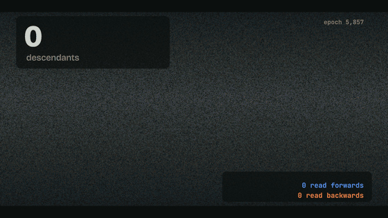

# Proof of Life

**A formally verified origin of life in a digital primordial soup.**

In Google's *Computational Life* experiment, self-replicating programs appear on their own in a soup of random code. We re-ran that experiment in 88 worlds, found the exact collision where life began in one of them, and proved in Lean 4 that what came out of it copies itself into **every one of the 256<sup>64</sup> possible partners**.

<p align="center"></p>

**▶ [Video (28 s)](https://ma4ypic4y.github.io/proof-of-life/) · [Run the proof in your browser](https://ma4ypic4y.github.io/proof-of-life/proof/) · [The mirror-strand study](https://ma4ypic4y.github.io/proof-of-life/life/)**

---

## Results

**1. A birth, certified.** World 52, epoch 5,858, collision 30,117 of 65,536. Two programs that cannot copy themselves are paired. No mutation touches them. One of the two programs that come out copies itself, reversed, into any partner, and so does its mirror image. 49 epochs later it has 91,764 descendants. We rebuilt the collision byte for byte from the simulator's own random streams, and Lean checks all of it as one theorem:

```lean
theorem birth_certificate_world52 :
    -- the actual collision
    run (A ++ B) = A_out ++ C ∧
    -- the newborn copies itself, reversed, into any partner, and so does its mirror strand
    (∀ X : Vector UInt8 64, run (C ++ X) = C ++ C.reverse) ∧
    (∀ X : Vector UInt8 64, run (C.reverse ++ X) = C.reverse ++ C) ∧
    -- neither parent is a replicator
    (run (A ++ killer_A) ≠ A ++ A.reverse ∧ run (A ++ killer_A) ≠ A ++ A) ∧
    (run (B ++ killer_B) ≠ B ++ B.reverse ∧ run (B ++ killer_B) ≠ B ++ B)
```

**2. Life copies itself backwards.** Under the paper's rules, 23 of the 24 replicators that emerged copy themselves backwards: the read head walks forward over the parent while the write head walks backward through the partner. In 22 of them the reversal is exact (byte *i* of the parent lands at byte 127 − *i*). Across whole living soups, **99.99% of 24.2 million copy steps run backwards**. So every species lives as two mirror strands in equal numbers (world 52 ends with 45,393 forward and 45,405 reversed copies). The soup meets this constraint in two ways: 7 genomes are palindromes, and 15 carry two different copy machines, one for each reading direction.

**3. One rule of the physics decides it.** In the paper's BFF, both copy heads start at position 0, and one step left lands in the partner. In cubff's `bff` variant, a genome sets its own heads. There, all 28 origins copy forwards (**0.00% of 35.7 million steps backwards**), and none has a mirror strand. Before life, random soups lean backwards under the first rule (87% of accidental copy steps) and not at all under the second (51%). Life then commits completely to one direction.

**4. A verified atlas, and why backwards is safer.** Every organism was run once against a partner whose bytes are all *unknown*. Lean replays the run and proves that no decision depends on the partner.

| | heads start at 0 (paper) | heads set by the genome |
|---|---|---|
| organisms | 25 (24 evolved + the paper's Figure 4 replicator) | 28 |
| exact copy proved for all 256<sup>64</sup> partners | **22** | **7** |
| lineage proved closed (+ ⇄ −) | 21 | — |
| loop test reads a partner byte | 3 | 21 |

A backward copier writes a byte and then tests the byte it just wrote. Most forward copiers test the byte ahead of the write head, which still belongs to the partner. World 50 is the one near-miss under the paper's rules. Its only weak spot is its partner's last byte:

```lean
theorem World50.achilles : ∀ B : Vector UInt8 64, B[63] ≠ 0 → run (P ++ B) = P ++ P.reverse
```

8 near-immortal organisms also have a Lean-checked *killer partner*. Forward copiers 1007, 1008 and 1012 die exactly when their partner's first byte is 0; this is tested on every value, and their killers are proved.

**5. The reproduction holds.** Life appeared in 24 of 58 worlds within 16,384 epochs (41%). The paper reports 40% with the same settings: 131,072 programs, mutation 1/4096, 8,192 steps.

**Act two: a primordial soup of prompts.** We kept the protocol and replaced the chemistry with a small local LLM (Qwen2.5-1.5B-Instruct). In each pair, one text is the system prompt and the other is the user message, and the reply overwrites the user message. Within a few epochs about half the soup becomes "I'm sorry, could you clarify?", an attractor rather than a replicator. Then topics persist in place: over the last 10 of 120 epochs, 69% of rewrites keep their slot's lineage and only 6% copy the system prompt. That is heredity without reproduction. With the roles swapped, the same model copies 68% of the time. See [REPORT.md](REPORT.md#act-two-a-primordial-soup-of-prompts).

## Trust

- **Engine.** [`engine/tol.c`](engine/tol.c) produces soups byte-identical to Google's [cubff](https://github.com/paradigms-of-intelligence/cubff) at all 150 checkpoints compared: four regimes, both head rules, fast and naive builds. It is 4–5× faster on a CPU because it skips runs of inert bytes and fast-forwards exact cycles. A world is a pure function of its seed: re-running it on another Mac comes alive at the same epoch.
- **Lean.** Every computation uses `decide +kernel`. There is no `native_decide`, `sorry` or `admit`. The only axioms are `propext` and `Quot.sound`. Kernel runs are split into 512-step chunks whose boundaries the kernel re-derives. A clean rebuild of all 68 modules from an empty cache on a Mac mini (M4), one module at a time, took 44 minutes, and all 60 main theorems report only `[propext, Quot.sound]` ([`lean/verify_report.json`](lean/verify_report.json), [`lean/logs/`](lean/logs)).
- **Gap.** The theorems are about a Lean transcription of BFF. It matches our Python and C interpreters on 240 test tapes. That link is tested, not proved.
- **Honest misses.** World 55's mirror strand resists the method (its loop reads a partner byte before overwriting it). The soup-wide direction metric had a bug in its first version, which the random-soup controls exposed. It is described in the report.

## Reproduce

```bash
# 1. engine (needs brotli: brew install brotli)
cc -O3 -I$(brew --prefix brotli)/include engine/tol.c -L$(brew --prefix brotli)/lib -lbrotlienc -lm -o engine/tol
cc -O3 -w -I$(brew --prefix brotli)/include engine/copygeo.c -L$(brew --prefix brotli)/lib -lbrotlienc -lm -o engine/copygeo

# 2. world 52, from its seed: comes alive at epoch 5,905 (entropy threshold); the lineage's first program appears at 5,858
engine/tol --seed 52 --max-epochs 6162 --log w52.csv --census w52.jsonl --save-at 5857,5858 --save-prefix snap_
python3 analysis/birth.py snap_5857.dat snap_5858.dat "$(python3 -c "import json;print([w for w in json.load(open('web/data/atlas.json'))['noheads'] if w['seed']==52][0]['rep'])")" 52 5857

# 3. the Lean proofs (Lean 4.21.0 via elan; ~4 GB RAM per module, build one at a time on 16 GB machines)
cd lean && lake build        # prints the axioms of every main theorem

# 4. the atlas (about 12 minutes per world per CPU core; results already in data/) and its analysis
python3 experiments/atlas.py 1 58 data/atlas --jobs 8
python3 experiments/atlas.py 1001 1030 data/atlas_heads --jobs 8 --heads
python3 analysis/build_data.py && python3 analysis/classify.py && python3 analysis/abstract.py && python3 analysis/killers.py
experiments/copygeo_all.sh data        # soup-wide copy direction, with random-soup controls

# 5. cross-check the engine against cubff (build cubff with CUDA=0 first)
CUBFF=/path/to/cubff/bin/main engine/validate.sh
```

## Repository layout

| Path | What |
|---|---|
| [`engine/`](engine) | `tol.c`: byte-exact cubff re-implementation with exact speed-ups. `copygeo.c`: soup-wide copy-direction census. `validate.sh`: three-way check against cubff. |
| [`lean/`](lean) | `ProofOfLife/Semantics.lean` (BFF, both head rules), `Abstract.lean` (unknown-partner interpreter and its soundness proof), `Organisms/` (one module per organism), `Birth52/` (the birth certificate), `Atlas.lean`, `atlas_report.json`, `verify_report.json`, build logs. |
| [`analysis/`](analysis) | Independent Python interpreter, abstract interpreter, classification, killer search, birth reconstruction, film and figure rendering. |
| [`experiments/`](experiments) | `atlas.py` (many worlds), `copygeo_all.sh` (copy-direction census with controls), `prompt_soup.py` (the LLM soup, run with MLX). |
| [`data/`](data) | Results: per-world logs and censuses of both atlases, classification, abstract-run results, killers, the birth reconstruction, copy-direction census, raw prompt-soup runs (`.jsonl.gz`). |
| [`web/`](web) | Sources of the interactive pages, a byte-exact JavaScript port of the engine (`bff-engine.js` + `test/validate.mjs`), capture scripts. |
| [`docs/`](docs) | The public site (GitHub Pages). |
| [`media/`](media) | GIF, poster and the video's scene source (`video/scene.html`, rendered frame by frame from real data). |
| [`REPORT.md`](REPORT.md) | Full write-up: methods, numbers, controls, limitations. |

## Credits

The experiment, the BFF language and the original findings are from *Computational Life: How Well-formed, Self-replicating Programs Emerge from Simple Interaction* by Blaise Agüera y Arcas, Jyrki Alakuijala, James Evans, Ben Laurie, Alexander Mordvintsev, Eyvind Niklasson, Ettore Randazzo and Luca Versari ([arXiv:2406.19108](https://arxiv.org/abs/2406.19108)); reference code [cubff](https://github.com/paradigms-of-intelligence/cubff) (Apache-2.0, not vendored here). Inspired by [BRLabs' browser reproduction](https://www.brlabsgroup.com/research/computational-life/). Built with [Claude Code](https://claude.com/claude-code).

MIT License. If you use this, please cite the original paper and this repository ([CITATION.cff](CITATION.cff)).
